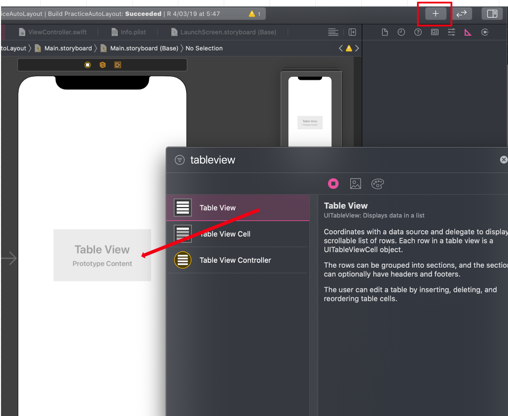

# UITableViewとは

TableViewとはiOSのアプリケーションで良く用いられる、垂直方向にスクロールしながら情報を表示することの出来るUIViewのサブクラスの一つです。

> 

### 特徴

- スクロールは垂直方向にのみ行うことができる
  - (補足: iOS6から垂直と水平の両方にセルを置くことの出来るUICollectionViewが登場しました）
- 表示するコンテンツはセルとよばれる単位ごとに構成し、セクションで区切ることもできる
- delegateやdatasourceなどのプロトコルを実装することで、表示するデータなどを制御する

### どういう時に使うのか

Appleのドキュメントによると、以下のような目的で利用することを想定しています。
- 階層構造のデータ内をユーザが移動できるようにする
- インデックス付きの項目リストを表示する
- 視覚的にグループ分けされた詳細情報とコントロールを表示する
- 選択可能な選択肢リストを表示する

### UITableViewの構造

- datasourceとdelegateの二つのプロトコルを持つ
  - datasource : 各行やセクションに埋めるデータを供給する役割を持つ
  - deleagte : viewの外観やセルが選択された時にとるアクションを定義する
- 各行はセルを用いて描画を行う
- 各行ごとに選択された時に何かしら動作を行う


# 実習

このUITableViewを実際に表示しながら、TableViewの仕組みに慣れて行きましょう

#### サンプルプロジェクトの作成

- Xcodeからサンプルプロジェクトを開き、新しいプロジェクトでSingle View Applicationを選びます。


- storyboardのViewControllerを選び、viewにTableViewをドロップします。



- storyboardのViewController.swiftのtableviewとを結びます。


- UITableViewDataSourceとUITableViewDelegateの継承を宣言します。

```swift
class ViewController: UIViewController, UITableViewDelegate, UITableViewDataSource {

    @IBOutlet weak var tableView: UITableView!

    // 省略
}
```
- tableViewのdataSourceとdelegateをselfにセットします

```swift
override func viewDidLoad() {
    super.viewDidLoad()

    tableView.delegate = self
    tableView.dataSource = self
}
```
こうすることで、tableviewのデータの源(何個セルを表示するか、セルに何を表示するか)としての働きと、見た目(各セルの高さやセルが選択されたときのアクション)などの処理が委譲されたことになります。

#### tableviewのdataSource, delegateメソッドの追加
UITableViewのDataSourceやDelegateには主に以下のメソッドがあります

**UITableViewDataSource**

- `tableView(_:numberOfRowsInSection:)`
  - section目のセクションにいくつ行があるかを返す
- `tableView(_:cellForRowAt:)`
  - indexPathの位置にあるセルを返す
- `numberOfSections(in:)`
  - tableViewにいくつセクションがあるか。明記しない場合は1つ
- `tableView(_:titleForHeaderInSection:)`
  - section目のセクションのタイトルを返す


**UITableViewDelegate**

- `tableView(_:heightForRowAt:)`
  - indexPathの位置にあるセルの高さを指定
- `tableView(_:didSelectRowAt:)`
  - indexPathの位置にあるセルが選択された時に呼ばれる
- `tableView(_:viewForHeaderInSection:)`
  - section目のセクションのヘッダービューを作って返す

※indexPathとは
- 第hoge章、第fuga段落、第piyo項目のような階層構造のindexを指定できるオブジェクト
- よく使うのは indexPath.section と indexPath.row

※ DataSourceとDelegateの詳細はこちらをどうぞ
- [https://developer.apple.com/reference/uikit/uitableviewdatasource](https://developer.apple.com/reference/uikit/uitableviewdatasource)
- [https://developer.apple.com/reference/uikit/uitableviewdelegate](https://developer.apple.com/reference/uikit/uitableviewdelegate)

この中で、@requiredなメソッドである`tableView(_:cellForRowAt:)`と`tableView(_:numberOfRowsInSection:)`を実装します。

```swift
func tableView(_ tableView: UITableView, numberOfRowsInSection section: Int) -> Int {
    return 10
}

func tableView(_ tableView: UITableView, cellForRowAt indexPath: IndexPath) -> UITableViewCell {
    let cell = tableView.dequeueReusableCell(withIdentifier: "cell")!
    cell.textLabel?.text = "\(indexPath.row)"
    return cell
}
```

**`dequeueReusableCell(withIdentifier:)`について**  
UITableViewでは、同じタイプのセルを使い回すことがよくあるため、内部でそのセルをキャッシュしておく仕組みがあります。  
一度表示したけど非表示になったセルなどがこのキャッシュに回されて`dequeueReusableCell(withIdentifier:)`を使うことでキャッシュされたセルを再利用して表示します。  
利用するセルはtableViewに予め登録しておく必要があります。  
登録には`register(_:forCellReuseIdentifier:)` のメソッドを利用します。  
registerClassには利用するセルのクラスを、CellReuseIdentifierにはキャッシュから引いてくるときに利用する識別子を指定します。  
登録は、viewDidLoadなどの初期化のときにしておくと良いでしょう。

```swift
tableView.register(UITableViewCell.self, forCellReuseIdentifier: "cell")
```

ここまでを実行して、このような画面が出て来れば成功です。


#### 時間があれば

###### 1. セルの再利用

行の数を100個ほどに`tableView(_:cellForRowAt:)`を以下のように書き換えてみてください。
途中から番号がおかしいものがちらほら出てくると思います。これは、セルを再利用した結果以前書き込んだ内容が消去されていないために起きます。

```swift
func tableView(_ tableView: UITableView, numberOfRowsInSection section: Int) -> Int {
    return 100
}

func tableView(_ tableView: UITableView, cellForRowAt indexPath: IndexPath) -> UITableViewCell {
    let cell = tableView.dequeueReusableCell(withIdentifier: "cell")!
    if indexPath.row % 3 == 0 {
        cell.textLabel?.text = "\(indexPath.row)" // 3で割り切れるときのみ、textを代入
    }
    return cell
}
```

###### 2. TableViewのスタイルを変える
UITableViewには`Plain`, `Grouped`の二種類のスタイルが用意されています。デフォルトではPlainが設定されていますが、storyboard上から変更することも可能です。
Attribute Inspector から Table View のスタイルを変更してみてください。
